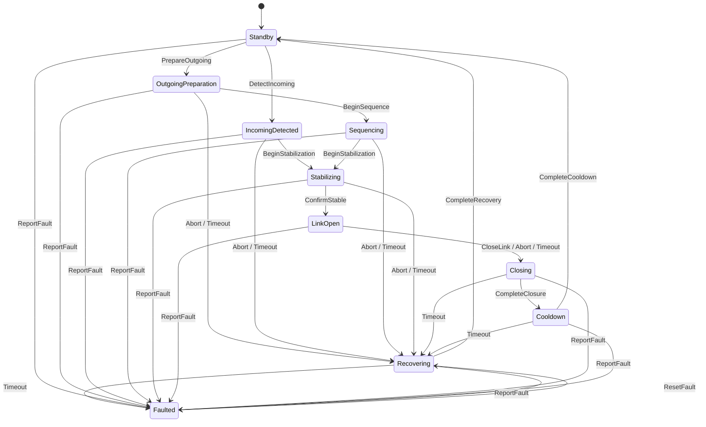

# Transit Array state machine

This document is the authoritative transition specification for the deterministic Core state machine introduced by issue #17. The implementation lives in `WormholeWorlds.Core.Transit` and has no Godot, wall-clock, storage, or presentation dependency.

## Phases and transitions

`ReportFault` requires a stable reason code. Commands also carry an explicit non-negative simulation timestamp; a timestamp older than the current phase entry is rejected. Rejected commands never mutate state or advance event sequence numbers.

## Unscheduled incoming

`DetectIncoming` moves Standby directly to `IncomingDetected`. Unscheduled incoming links skip Destination Vector sequencing and Vector Locks: the operator begins stabilization from `IncomingDetected`, confirms a stable link, then authenticates at Return Control. Application and Core connection guards reserve a fixed prototype power/cooling budget for that session (see `OutgoingConnection.UnscheduledIncoming`).

## Safety rules

- Abort before a stable link enters Recovering. Resource reservations added by issue #18 must be released atomically with that transition.
- Abort or timeout while a link is open uses controlled Closing rather than bypassing closure.
- Transitional timeouts enter Recovering. A timeout during recovery is unrecoverable and enters Faulted.
- Faulted can leave only through explicit ResetFault, which enters Recovering before the system may return to Standby.
- Direction is retained through closing, cooldown, recovery, and fault inspection, then cleared only on a safe return to Standby.
- The state machine emits immutable, monotonically sequenced events. Later replay support records these events without changing the transition rules.

The exhaustive table-driven test suite evaluates every command against every phase. Adding a command or phase requires updating both this document and the complete transition matrix.
